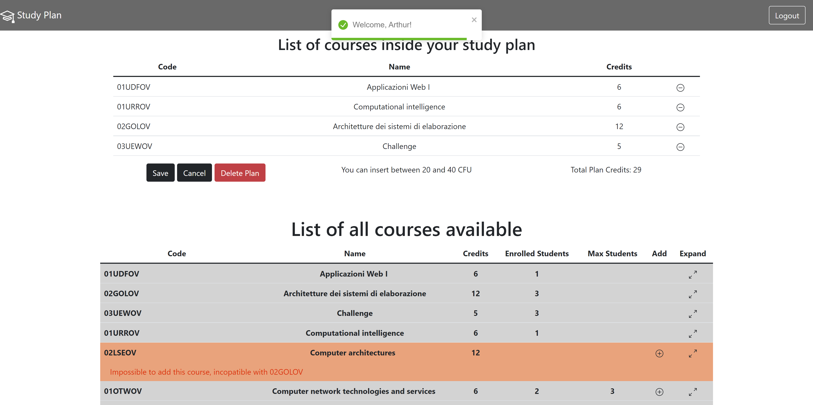

# Exam #1: "StudyPlan"
## Student: s295555 ZANFARDINO DIEGO 

## React Client Application Routes

- Route `/`: This is the main route of the application. This route will show only the available courses to unregistered users. To logged-in users the application will also show their personal study plan.
- Route `/login`: this route contain the login form to perform authentication (by email and password).
- Route `*`: this route is shown when a different route compared to previous ones is requested. It only contains an error message. 

## API Server
### APPLICATION API
- GET `/api/courses`
  - request parameters and request body empty
  - returns a JSON containing all the available courses:
  ```
  [{
    "code": "02GOLOV",
    "name": "Architetture dei sistemi di elaborazione",
    "credits": 12,
    "maxStudents": null,
    "incopatibleWith": [
      "02LSEOV"
    ],
    "PreparatoryCourse": null,
    "enrolledStudents": 3
  },
  {
    "code": "01SQMOV",
    "name": "Data Science e Tecnologie per le Basi di Dati",
    "credits": 8,
    "maxStudents": null,
    "incopatibleWith": [
      "01SQJOV",
      "01SQLOV"
    ],
    "PreparatoryCourse": null,
    "enrolledStudents": ""
  },...]
  ```

- GET `/api/studyplan`
  - request parameters and request body empty, require authenitcated user
  - returns a JSON containing the user id and all the courses (only the code) in the personal study plan, if any: 
  ```
  [{
    "user": 1,
    "course": "01UDFOV"
  },
  {
    "user": 1,
    "course": "01URROV"
  },...]
  ```

- POST `/api/studyplan`
  - request body is a JSON object containing an array of course and the full-time/part-time choice. Authenticated user is required:
  ```
  {
    "studyplan":["02KPNOV","01TXYOV", "05BIDOV"],
    "time":"part"
  }
  ```
  - response body is empty but `200 OK` is returned in case of success. The following error responses are available: 
    - status: `422 Unprocessable Entity`, message: `Data not valid, validation errors`;
    - status: `422 Unprocessable Entity`, message: `Course not found in DB, impossible to add`;
    - status: `422 Unprocessable Entity`, message: `Course + "course.code" + already reached max number of students`;
    - status: `422 Unprocessable Entity`, message: `Costraint for credit number of full-time/part-time study plan violated`;
    - status: `422 Unprocessable Entity`, message: `Preparatory course constraint violated`
    - status: `422 Unprocessable Entity`, message: `Incompatible course constraint violated`;
    - status: `500 Internal Server Error`, message: `Error in Database`;

- DELETE `/api/studyplan`
  - request parameters and request body empty, require authenitcated user
  - response returns `200 OK` on success
***
### USER API 
- POST `/api/sessions`
  - request parameters empty, request body contains user credentials
  - response body contains a JSON with user informations:
  ```
  {
  "username": "arthur.dent@studenti.polito.it",
  "password": "password"
  }
  ```
- GET `/api/sessions/current`
  - request parameters and request body empty, require authenitcated user
  - response body contains a JSON with updated user informations:
  ```
  {
  "id": 1,
  "username": "arthur.dent@studenti.polito.it",
  "name": "Arthur",
  "time": "full"
  }
  ```
- DELETE `/api/sessions/current`
  - request parameters and request body empty, require authenitcated user
  - response gives `200 OK` on success


## Database Tables
- Table `courses` contains 
  |Field|Value|
  |--|--|
  |code|unique identifier for the course|
  |name|name of the course|
  |credits|number of credits for the course|
  |maxStudents|if present, represent the maximum number of students that can enroll in this course|
  |preparatoryCourse|if present, the oreoaratory course needed for the course identified bu the code|
  |enrolledStudents|number of students that already chose this course updated at every insert and delete in studyPlans|

- Table `users` contains 
  |Field|Value|
  |--|--|
  |id|unique identifier for the user|
  |email|email of the user that also play the role of username during login|
  |name|name of the user, displayed in welcome message at login|
  |hash|hashed value of the password, combined with the salt|
  |salt|unique and random value, added to increase DB security|
  |time|text field that indicates the study plan mode (full-time/part-time). `NULL` if not set yet|
  
  `id` is the primary key for the table.

- Table `incopatible` contains 
  |Field|Value|
  |--|--|
  |code|code of the subject course|
  |incopatible|incompatible course for the course represented by the code|
  
  Both `code` and `incopatible` are primary key. 

- Table `studyPlans` contains 
  |Field|Value|
  |--|--|
  |user|id of the user|
  |course|course associated to the user identified by the id|
  
  Both `user` and `course` are primary key. In this way at DB level the user can not have duplicated courses in the study plan. 

## Main React Components
- `NavBarApp` (in `navBarComponents.js`): renders the navbar and login/logout buttons based on `loggedIn` state.
- `LoginForm` (in `authenticationComponents.js`): renders the login page. 
- `StudyPlanApp` (in `studyPlanComponents.js`): if the user is logged-in and a studyplan already exists, renders it in a table. 
- `CreateStudyPlan` (in `studyPlanComponents.js`):  if the user is logged-in and a study plan doesn't exists for the logged-in user, gives the opportunity to create one. 
- `CourseApp` (in `courseComponents.js`): renders the list of all available courses offered. If the user is logged-in a column that gives the opportunity to add the course to the study plan is added. 
- `CourseData` (in `courseComponents.js`): diplays in every row of the table all the information about the course. Based on the value of a state this section could be expanded/contracted to show additional information about the course. All the constraint are verified when the add button is clicked. 
- `DefaultRoute` (in `courseRoute.js`): renders the page when the default route is taken. 

## Screenshot



## Users Credentials
|#|Username|Password|Study Plan|
|----|----|----|----|
|1|arthur.dent@studenti.polito.it| password|part-time|
|2|elliot.anderson@studenti.polito.it| password|full-time|
|3|guy.montag@studenti.polito.it| password|part-time|
|4|mario.semprefino@studenti.polito.it| password|full-time|
|5|winston.smith@studenti.polito.it| password|not defined yet|


